# Genealogies

## Relations

Find parents for an individual. The result is a named tuple of `Individual`s.

```{julia}
using GedCom
abeparents = GedCom.parents(lincoln, gen)
abeparents[:mother]
```
```@example gen
abeparents[:father]
```

Use the exported `label` function to label a `FamilyUnit` with names of both spouses:

```@example gen
label(fam, gen)
```


The `FamilyUnit` stays close to the GEDCOM structure: its most crucial information is just a series of pointers to individuals in roles of spouse or children.  `GedCom.jl` also includes a `NuclearFamily` type where those pointers are replaced with fully instantiated `Individual`s.

```@example gen
nuke = GedCom.nuclearfamily(fam, gen)
typeof(nuke)
```

```@example gen
label(nuke.husband)
```


```@example gen
label(nuke.wife)
```

```@example gen
length(nuke.children)
```

## Charts


Diagram an ancestor tree for an individual in the genealogy.  The result is the text of a [Mermaid diagram](https://mermaid-js.github.io/mermaid/#/).


```@example gen
GedCom.ancestors_mermaid(lincoln, gen)
```

Embedded in a `mermaid` block, the output is rendered like this:

```mermaid
graph TD
    I317("Abraham Lincoln (1809-1865)") --> F173( )
    F173 --> I318("Thomas Lincoln (1778-1851)")
    I318("Thomas Lincoln (1778-1851)") --> F175( )
    F175 --> I320("Abraham Lincoln (1744-1786)")
    I320("Abraham Lincoln (1744-1786)") --> F177( )
    F177 --> I324("John Lincoln (1716-1788)")
    I324("John Lincoln (1716-1788)") --> F181( )
    F181 --> I332("Mordecai Lincoln II (1686-1736)")
    I332("Mordecai Lincoln II (1686-1736)") --> F187( )
    F187 --> I344("Mordecai Lincoln (1657-1727)")
    I344("Mordecai Lincoln (1657-1727)") --> F194( )
    F194 --> I358("Samuel Lincoln (1619-1690)")
    I358("Samuel Lincoln (1619-1690)") --> F200( )
    F200 --> I370("Edward Lincoln (1575-1638)")
    I370("Edward Lincoln (1575-1638)") --> F206( )
    F206 --> I382("Richard Lincoln (-1619)")
    I382("Richard Lincoln (-1619)") --> F208( )
    F208 --> I384("Robert Lincoln (-1556)")
    I384("Robert Lincoln (-1556)") --> F209( )
    F209 --> I387("Robert Lincoln (-1543)")
    I387("Robert Lincoln (-1543)") --> I387_NO_FAMC( )
    F209 --> I388("_____ Bawdiven (n.d.)")
    I388("_____ Bawdiven (n.d.)") --> I388_NO_FAMC( )
    F208 --> I385("Margaret Alberye (n.d.)")
    I385("Margaret Alberye (n.d.)") --> I385_NO_FAMC( )
    F206 --> I383("Elizabeth Remching (n.d.)")
    I383("Elizabeth Remching (n.d.)") --> I383_NO_FAMC( )
    F200 --> I371("Bridget Gilman (n.d.)")
    I371("Bridget Gilman (n.d.)") --> F207( )
    F207 --> I394("Edward Gilman (n.d.)")
    I394("Edward Gilman (n.d.)") --> I394_NO_FAMC( )
    F194 --> I359("Martha Lyford (1625-1693)")
    I359("Martha Lyford (1625-1693)") --> F201( )
    F201 --> I372("John Lyford (-1634)")
    I372("John Lyford (-1634)") --> I372_NO_FAMC( )
    F201 --> I373("Sarah _____ (n.d.)")
    I373("Sarah _____ (n.d.)") --> I373_NO_FAMC( )
    F187 --> I345("Sarah Jones (-1701)")
    I345("Sarah Jones (-1701)") --> F195( )
    F195 --> I360("Abraham Jones (1630-1717)")
    I360("Abraham Jones (1630-1717)") --> F202( )
    F202 --> I374("Thomas Jones (1603-1679)")
    I374("Thomas Jones (1603-1679)") --> I374_NO_FAMC( )
    F202 --> I375("Ann Cowdrie (1603-1657)")
    I375("Ann Cowdrie (1603-1657)") --> I375_NO_FAMC( )
    F195 --> I361("Sarah Whitman (-1718)")
    I361("Sarah Whitman (-1718)") --> F203( )
    F203 --> I376("John Whitman (1603-1691)")
    I376("John Whitman (1603-1691)") --> I376_NO_FAMC( )
    F203 --> I377("Ruth Reed (b. 1605)")
    I377("Ruth Reed (b. 1605)") --> I377_NO_FAMC( )
    F181 --> I333("Hannah Salter (-1727)")
    I333("Hannah Salter (-1727)") --> F188( )
    F188 --> I346("Richard Salter (-1728)")
    I346("Richard Salter (-1728)") --> I346_NO_FAMC( )
    F188 --> I347("Sarah Bowne (1669-1714)")
    I347("Sarah Bowne (1669-1714)") --> F196( )
    F196 --> I362("John Bowne (1630-1683)")
    I362("John Bowne (1630-1683)") --> F204( )
    F204 --> I378("William Bowne (-1677)")
    I378("William Bowne (-1677)") --> I378_NO_FAMC( )
    F204 --> I379("Anne Laverock (n.d.)")
    I379("Anne Laverock (n.d.)") --> I379_NO_FAMC( )
    F196 --> I363("Lydia Holmes (-1693)")
    I363("Lydia Holmes (-1693)") --> F205( )
    F205 --> I380("Obadiah Holmes (1608-1681)")
    I380("Obadiah Holmes (1608-1681)") --> I380_NO_FAMC( )
    F205 --> I381("Katherine Hyde (n.d.)")
    I381("Katherine Hyde (n.d.)") --> I381_NO_FAMC( )
    F177 --> I325("Rebecca Flowers (1720-1806)")
    I325("Rebecca Flowers (1720-1806)") --> F182( )
    F182 --> I334("Enoch Flowers (b. 1693)")
    I334("Enoch Flowers (b. 1693)") --> F189( )
    F189 --> I348("William Flower (n.d.)")
    I348("William Flower (n.d.)") --> I348_NO_FAMC( )
    F189 --> I349("Elizabeth Moris (n.d.)")
    I349("Elizabeth Moris (n.d.)") --> I349_NO_FAMC( )
    F182 --> I335("Rebecca Barnard (n.d.)")
    I335("Rebecca Barnard (n.d.)") --> F190( )
    F190 --> I350("Richard Barnard (-1698)")
    I350("Richard Barnard (-1698)") --> I350_NO_FAMC( )
    F190 --> I351("Frances Lambe (n.d.)")
    I351("Frances Lambe (n.d.)") --> F197( )
    F197 --> I364("Richard Lambe (n.d.)")
    I364("Richard Lambe (n.d.)") --> I364_NO_FAMC( )
    F197 --> I365("Lucy Baillie (n.d.)")
    I365("Lucy Baillie (n.d.)") --> I365_NO_FAMC( )
    F175 --> I321("Bathsheba Herring (1750-1836)")
    I321("Bathsheba Herring (1750-1836)") --> F178( )
    F178 --> I326("Alexander Herring II (1708-1778)")
    I326("Alexander Herring II (1708-1778)") --> F183( )
    F183 --> I336("Alexander Herring (-1735)")
    I336("Alexander Herring (-1735)") --> I336_NO_FAMC( )
    F183 --> I337("Margaret _____ (-1735)")
    I337("Margaret _____ (-1735)") --> I337_NO_FAMC( )
    F178 --> I327("Abigail Harrison (1710-1780)")
    I327("Abigail Harrison (1710-1780)") --> F184( )
    F184 --> I338("Isaiah Harrison (1666-1738)")
    I338("Isaiah Harrison (1666-1738)") --> I338_NO_FAMC( )
    F184 --> I339("Abigail Smith (1678-1732)")
    I339("Abigail Smith (1678-1732)") --> I339_NO_FAMC( )
    F173 --> I319("Nancy Hanks (1784-1818)")
    I319("Nancy Hanks (1784-1818)") --> F176( )
    F176 --> I322("James Abraham Hanks (1759-1810)")
    I322("James Abraham Hanks (1759-1810)") --> F179( )
    F179 --> I328("Joseph Hanks (1725-1793)")
    I328("Joseph Hanks (1725-1793)") --> F185( )
    F185 --> I340("Luke Hanks (1686-1757)")
    I340("Luke Hanks (1686-1757)") --> F191( )
    F191 --> I352("William Hanks (1650-1704)")
    I352("William Hanks (1650-1704)") --> F198( )
    F198 --> I366("Thomas Hanks (-1674)")
    I366("Thomas Hanks (-1674)") --> I366_NO_FAMC( )
    F198 --> I367("Elizabeth _____ (n.d.)")
    I367("Elizabeth _____ (n.d.)") --> I367_NO_FAMC( )
    F191 --> I353("Sarah Woodbridge (n.d.)")
    I353("Sarah Woodbridge (n.d.)") --> I353_NO_FAMC( )
    F185 --> I341("Elizabeth _____ (b. 1694)")
    I341("Elizabeth _____ (b. 1694)") --> I341_NO_FAMC( )
    F179 --> I329("Nanny _____ (b. 1728)")
    I329("Nanny _____ (b. 1728)") --> I329_NO_FAMC( )
    F176 --> I323("Lucy Shipley (1765-1825)")
    I323("Lucy Shipley (1765-1825)") --> F180( )
    F180 --> I330("Robert Shipley II (n.d.)")
    I330("Robert Shipley II (n.d.)") --> F186( )
    F186 --> I342("Robert Shipley (1678-1763)")
    I342("Robert Shipley (1678-1763)") --> F192( )
    F192 --> I354("Adam Shipley (1647-1698)")
    I354("Adam Shipley (1647-1698)") --> I354_NO_FAMC( )
    F192 --> I355("Lois Howard (1655-1725)")
    I355("Lois Howard (1655-1725)") --> I355_NO_FAMC( )
    F186 --> I343("Elizabeth Stevens (n.d.)")
    I343("Elizabeth Stevens (n.d.)") --> F193( )
    F193 --> I356("Charles Stevens II (1645-1703)")
    I356("Charles Stevens II (1645-1703)") --> F199( )
    F199 --> I368("Charles Stevens (1615-1658)")
    I368("Charles Stevens (1615-1658)") --> I368_NO_FAMC( )
    F199 --> I369("Susannah Norwood (b. 1620)")
    I369("Susannah Norwood (b. 1620)") --> I369_NO_FAMC( )
    F193 --> I357("Mary Elizabeth Connick (1645-1717)")
    I357("Mary Elizabeth Connick (1645-1717)") --> I357_NO_FAMC( )
    F180 --> I331("Sarah _____ (n.d.)")
    I331("Sarah _____ (n.d.)") --> I331_NO_FAMC( )
```

