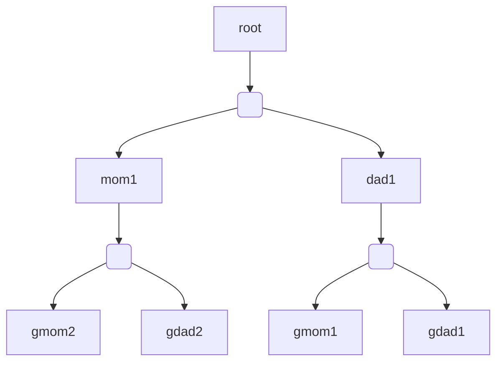
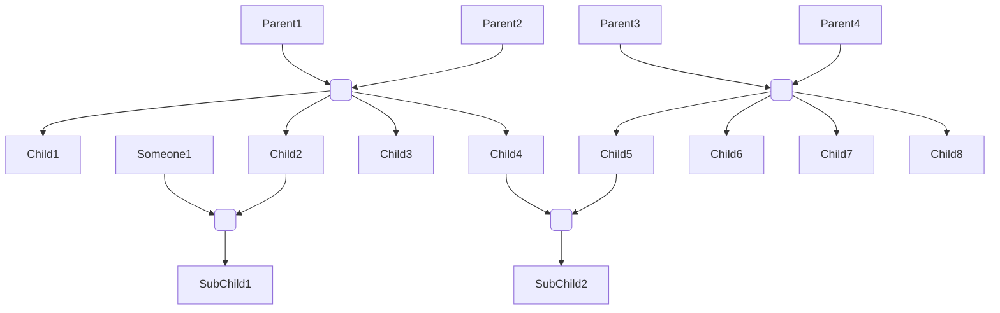

## Attempt at an ancestry chart

```mermaid
graph TD
    root --> f1( )
    f1 --> mom1
    f1 --> dad1
    dad1 --> f2( )
    f2 --> gmom1
    f2 --> gdad1
    mom1 --> f3( )
    f3 --> gmom2
    f3 --> gdad2

```

## External example

```mermaid
graph TD
    Parent1 --> p1p2( )
    Parent2 --> p1p2

    Parent3 --> p3p4( )
    Parent4 --> p3p4

    p1p2 --> Child1
    
    Someone1 --> c2x1
    Child2 --> c2x1( )

    p1p2 --> Child2
    p1p2 --> Child3
    Child4 --> c4c5( )
    Child5 --> c4c5
    p1p2 --> Child4

    p3p4 --> Child5
    p3p4 --> Child6
    p3p4 --> Child7
    p3p4 --> Child8

    c2x1 --> SubChild1

    c4c5 --> SubChild2

```